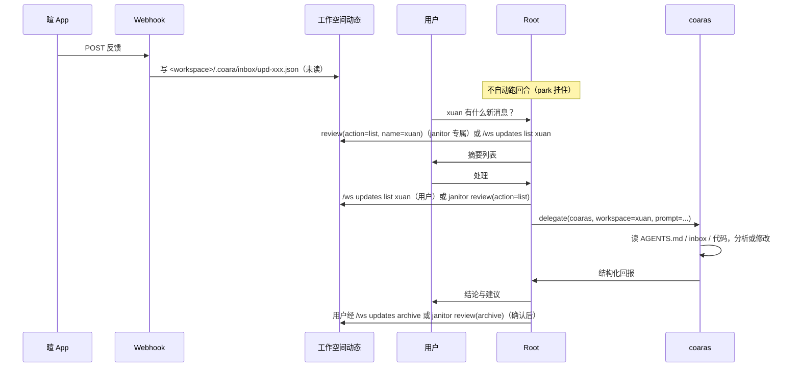

# 多工作空间与工作空间动态 — 编排模型

> **Canonical 编排文档**，与 `src/coara/`、`src/event_sources/`、`src/workspace/updates/` 对齐。
> **工作空间概念总览**（四种目录、cwd、name）→ [工作空间与目录.md](./工作空间与目录.md)。
> **存储路径** → [STORAGE_AND_WORKSPACES.md](./STORAGE_AND_WORKSPACES.md)。
> **动态数据模型**（字段、红点、去重、裁剪）→ [工作空间动态模型.md](./工作空间动态模型.md)。
> **事件源与管家制度细节** → [工作空间与事项制度.md](./工作空间与事项制度.md)。

---

## 目录

1. [一句话模型](#1-一句话模型)
2. [角色与边界](#2-角色与边界)
3. [多工作空间会话隔离（WorkspaceSession）](#3-多工作空间会话隔离workspacesession)
4. [同一工作空间名的四个落点](#4-同一工作空间名的四个落点)
5. [事件源与 salience / handle](#5-事件源与-salience--handle)
6. [定时触发（cron 事件源）速览](#6-定时触发cron-事件源速览)
7. [Root 编排规则与子代理选型](#7-root-编排规则与子代理选型)
8. [工作空间管理技能（生命周期）](#8-工作空间管理技能生命周期)
9. [完整链路：xuan 用户反馈](#9-完整链路xuan-用户反馈)
10. [手机端 coara App（Matrix 推送）](#10-手机端-coara-appmatrix-推送)
11. [coaras 与 janitor 设计共识](#11-coaras-与-janitor-设计共识)
12. [工具、命令与路径索引](#12-工具命令与路径索引)
13. [常见误解](#13-常见误解)
14. [源码索引](#14-源码索引)

---

## 1. 一句话模型

**工作空间是 coara 管理的活单位；外部事件与定时点经事件源收成消息；消息默认进工作空间动态；用户通过 Root 主动查看与批示；工作空间内读写执行由子智能体完成——模型委派走 coaras + `workspace` 锁定，事件/定时触发的无人值守过目走管家 janitor（系统专属，`handle: janitor` 或 cron 事件源唤醒）。**

```text
用户 ↔ Root（唯一对话入口）
         ├─ ws(list)              … 有哪些工作空间
         ├─ review(action=list|pending) … 看/管工作空间动态（janitor 专属；用户用 /ws updates）
         └─ delegate(coaras)      … 进工作空间执行（workspace 锁定）

工作空间 name
  ├─ 动态：外部事件与运行结果排队（updates）
  ├─ 数据：反馈 / inbox / 日志     → 委派子智能体管
  └─ 工程：代码 / 构建 / 部署       → 委派子智能体管

外界（App webhook、file_watch、轮询、cron…）
  → <workspace>/.coara/matters/definitions/*.yaml（workspace: name）
  → 事件内容无条件落动态收件箱；salience 决定曝光，handle 决定 park / 叫醒 janitor
```

---

## 2. 角色与边界

| 角色 | 定位 | 做什么 | 不做什么 |
|------|------|--------|----------|
| **用户** | 决策者 | 看消息、下指令、批准改代码/部署 | — |
| **Root（考拉助手）** | 用户接口与编排 | 听懂意图；查动态；向用户汇报；决定何时 delegate | 不亲自进其它已登记工作空间做 read/grep/shell |
| **janitor** | 工作空间管家 | 维护概况；写记忆；过目消息（勾掉噪音 / 呈阅要拍板的 / 能自己处理的处理掉，理由写进处置轨迹） | 不面对真实用户（只回报派出方）；无 `delegate`/`skill` |
| **coaras** | 并行工程 | 建仓、大改、脚手架、不绑工作空间的任务 | 不绑定工作空间身份，不承担巡检 |

**只有 janitor 绑定 `workspace=<name>`**（系统派发时经 registry 解析成目标工作空间根目录）。调研用 Root 激活 `research` 技能，不是 delegate。

---

## 3. 多工作空间会话隔离（WorkspaceSession）

### 3.1 模型

一个 coara 进程服务多个工作空间时，分工固定：

| 角色 | 职责 |
|------|------|
| **RootCoara** | 进程宿主：EventBus、UnifiedScheduler、workspace_manager、workflow_bridge、vault / reminder / event_source 等全局服务 |
| **WorkspaceSession** | 每个已切入工作空间一份：独立 `CoaraBase`（`message_history`、`session_id`、todo、工具、技能、`_process_lock`） |
| **`foreground_coara`** | 当前前台对话 agent；**始终**是某个 `WorkspaceSession` 的 `CoaraBase`。未绑定则初始化失败 |

启动时所在工作空间与之后切入的工作空间使用同一套规则：创建或复用 `WorkspaceSession`。

```text
RootCoara（进程宿主）
  ├─ WorkspaceSession[启动空间]  → CoaraBase（前台时 = foreground_coara）
  ├─ WorkspaceSession[其它空间]  → CoaraBase
  └─ 共享服务：EventBus、scheduler、workspace_manager、workflow、
     vault / reminder / event_source …
```

前端（CLI / Web / Matrix）一律经 `root.foreground_coara` 访问对话状态；全局服务经 `root` 上的宿主字段访问。

### 3.2 初始化绑定

`initialize_root_services` 在 `CoaraBase.initialize(root)` 之后调用 `_bind_foreground_workspace_session`：

1. 取 `workspace_manager` 当前活动登记项
2. `ensure_workspace_session(entry)` 创建 session
3. 设 `_foreground_session_id`，用前台 session 的路径 / session_id 发布 `active.json`

绑定失败直接抛错，进程不以 Root 充当对话 agent。

### 3.2.1 空间模型（同空间统一，共看即同步 chrome）

工作空间会话持有一份生效 `provider`/`model`。注册表条目（`registry/workspaces.yaml`）的
`provider` / `model` 字段 = 该空间 **last-run 模型**：最后一次正常对话（端输入
注入的回合）实际使用的模型，恒有值（未对话过的新空间由全局默认兜底）。
创建 `WorkspaceSession` 时按此解析（`src/workspace/llm_binding.py`）：

1. 条目有 last-run 且 provider 仍存在于 providers.yaml → session 用该值
2. 无 last-run / provider 已失效（告警）→ 跟随全局默认（`llm_preferences.yaml`，即 Root 种子）
3. 启动于新目录：自动登记条目、不写 last-run → 跟随全局默认；启动恢复退出时的空间则连同 last-run 一起回来

写路径（切换权在端，生效面是空间）：

- 每次正常对话回合开段时，把实际使用的 provider/model 回写为空间 last-run
  （`touch_entry_llm`，内容未变不重写盘）；janitor / 后台运行不更新
- 端 `/model <选择>`：作用**该端当前 view 所在空间**，写 last-run + 切该空间
  session；共看该空间的其它端 **chrome 立刻同步**（`llm_switched` 按
  workspace_id 投递）。回合中 LLM 连接可延迟到回合结束，显示先同步。
- `/model --global`：只改全局默认（新/未绑定空间种子），不强迫已绑定空间
- **同空间不允许多端各绑各的模型**（共享一份上下文）；不同空间、未共看的端互不影响

janitor 无端归属，触发时一定用该空间 last-run 模型（不再有 janitor 专属配置）。
`coara ws list` 的「模型」列显示 last-run 或「默认」。

视图切换仍是端独立：`set_view_workspace(end, …)`；`workspace_switched` 仅兼容
cli view，**不**广播到其它 attach 连接（各 attach 可 pin 不同空间）。

### 3.3 切换

端 UX / API：`RootCoara.set_view_workspace(end, name)`（`switch_workspace` 等价于
`end=cli`）。只改该端 view pin；**不** `os.chdir`、不拖其它端。cli view 额外同步
默认指针与 `active.json`；兼容事件 `workspace_switched`（`end=cli`）供本地
TraceStore 等订阅——**不**经 attach WS 广播到其它连接（各 attach 可 pin 不同空间）。

各会话状态留在各自 `WorkspaceSession` 上，切回即恢复。磁盘恢复见
[工作空间与目录.md](./工作空间与目录.md) §9；距上次活动超过 **2 小时**（阈值同
`session.idle_timeout_seconds`）的空间，cli 切入时可开新会话并提示。

### 3.4 回合中切换

**人类 / API 切换**（`/ws switch`、Web、Matrix）：**不**中断离开空间上正在跑的那一轮。该 `WorkspaceSession` 继续把当前 `process_message` 跑完；对话焦点转到目标空间。切走后原空间的回合在 CLI **过程不上屏**，回合收尾时把最终答复全文带工作空间名前缀投递一次（`[shop] Coara: …`，matrix 来源则 `[shop·Matrix]`）；Matrix 房间消息前缀 `[shop] `，Web WS 事件带 `detached: true` + `workspace_name` 字段（前端徽标渲染为后续工作）。历史仍写在原 session，切回可见。

**切回重挂（re-attach）**：切走时 CLI 对该回合的直接迭代已 detach（`iter_while_foreground`），由后台 drain 收尾。detach 的触发有两路——下一 chunk 到达时的前台检查，以及等 chunk 期间 **0.2s 轮询**（`_DETACH_POLL_INTERVAL`）：回合静默期（长工具/等模型首包）没有 chunk，仅靠前者会把主循环钉死在旧回合上，新前台空间的输入（含斜杠命令）随之饿死、切回后输出也不上屏（两 bug 已于 2026-08-20 同根修复）。若切回时原回合还在跑，drain 把剩余 chunk 重新送入 CLI 流式块——工具行（✓/✗）与文本恢复上屏；流式块经 `ensure_streaming` 自愈重挂（按 block 实际状态重开，`reset_after_runtime_change` 时序竞争不再丢 chunk）；仍挂在外空间期间 drain 的 chunk 维持丢弃（最终答复由收尾投递通道带标签补上）。drain 结束或新回合开始会关闭重挂的流式块，不干扰新回合。

**切换期间输入处理**（CLI）：前台回合忙时，普通文本进接续输入队列（`submit_continuation_input`，下一迭代边界注入）；斜杠命令分两路——`RUN_WHILE_BUSY` 白名单（如 `/stop` `/model`，见 `src/coara/commands/registry.py`）经 `on_busy_slash` 立即执行不等回合，其余命令留在主循环排队等空闲。detach 轮询保证主循环不被旧回合钉死，新前台空间的这两类输入才能被及时消费。

**入队即绑定**：Matrix/Web 消息在 schedule 时捕获当前前台 session（`capture_matrix_turn_binding` / `_handle_chat` 入口），handler 全程使用绑定对象而非执行时重读 foreground——排队期间切空间，消息仍在发送时所见的空间处理；leftover continuation、媒体上传落点与回复回合同理。后台任务完成通知（`background_task_complete`）按**发起 session** 路由（`_resolve_session_coara_for_event`，与 shell 输出唤醒同一模式）：目标忙则进 continuation 队列，目标空闲则**唤醒一个新回合**（`source=background`，LLM 看到结果继续推进，CLI 无标签镜像显示）；aide结果例外——空闲时不唤醒，进驻会话历史（park），主会话「知道即可」；无 session 标记的遗留事件回退前台。

**已知边界**：`/stop` 与 Ctrl+C 只作用于前台 session——切走后后台跑着的 A 无法被中断（设计取舍；A 若卡在审批仍走原通道，回应即可解开；失控回由关机时的全 busy session interrupt 兜底）。

**LLM 回合内** `ws(action="switch")`：源会话以 `CoaraRunCancelledError` 结束；`strip_ws_switch_tail` 从 `ws(switch)` 上溯到触发切换的用户输入并删掉该段尾部；目标会话历史不动。离开空间的其余历史留在自己的 `WorkspaceSession`，切回即恢复。

### 3.5 工具面

每个 `WorkspaceSession` 注册完整对话工具面（进程无状态工具、runtime 工具、root-scoped 的 `plan_mode` / `orchestrator` / `skill` / `ws`，以及 vault / reminder / local_search（records 查询）等）。服务实例仍在 Root；工具挂在 session 上。`WsTool.parent_coara` 指向 Root，以便跨 session 切换。

---

## 4. 同一工作空间名的四个落点

业务上**只有一个工作空间 name**；coara Home 里分四处文件：

| 落点 | 路径 | 作用 |
|------|------|------|
| **登记** | `{coara_home}/registry/workspaces.yaml` | name → 工作空间根绝对路径、summary |
| **事件源** | `<workspace>/.coara/matters/definitions/*.yaml` | webhook / file_watch / interval_poll / cron；`workspace: <name>`（空间自治） |
| **动态** | `<workspace>/.coara/inbox/*.json` | 外部事件与运行结果的动态流（空间自治；旧集中布局启动时迁移） |

```text
registry:  暄 → D:\code_ws\xuan_android_local
events:    xuan-feedback-webhook  workspace: 暄  handle: park（默认）
updates:   D:\code_ws\xuan_android_local\.coara\inbox\upd-abc123def456.json
delegate:  workspace="暄"  →  锁定上述工作空间根
```

「工作空间管理」技能管的是登记 + 事件源 + 移出/加回这套生命周期，与「工作空间是否在册」是**同一件事**，不是两套体系。

---

## 5. 事件源与 salience / handle

### 5.1 事件源定义

事件源 YAML 放在 `<workspace>/.coara/matters/definitions/`（模板见仓库 `events/*.yaml.example`）。四种类型（`EventSourceKind`）：

| kind | 触发方式 | 关键字段 |
|------|----------|----------|
| `webhook` | HTTP POST 到 `…/webhook/{source_id}` | `webhook_secret` |
| `file_watch` | 监听目录文件变动 | `watch_path`、`watch_pattern`、`watch_events` |
| `interval_poll` | 定时轮询目录 | `interval_seconds`、`poll_min_count` |
| `cron` | cron 表达式到点触发（Asia/Shanghai） | `cron` |

公共字段：`id`、`enabled`、`workspace`（归属工作空间名）、`salience`（low/normal/high，显著性）、`handle`（park/janitor，处理模式）、`ttl_seconds`（消息保质期）、`cooldown_seconds`（默认 30 秒去重冷却）、`suggested_delegate`（仅提示用）、`message_template`。运行状态去重/冷却持久化在 `users/default/matters/.state/`。

聊天中 `/events` 查看状态、`/events reload` 重载定义。

### 5.2 落箱、显著性与处置

`EventSourceManager._handle_event()` 把事件内容**无条件**落所属空间的动态收件箱，然后：

| 机制 | 行为 | 适用 |
|------|------|------|
| 落收件箱（无条件） | 写入工作空间动态；**不**打扰 Root | 所有事件 |
| `salience: high` | 同时上浮到跨空间前台待处理视图（`review(action=pending)`） | 需要尽快被看见的事件 |
| `ttl_seconds` | 消息带保质期（`expires_at`），过期未读被纯规则过目自动 dismissed | 低价值通知 |
| `handle: janitor` | 叫醒管家 janitor 过目（`dispatch_janitor_message_review`）：勾掉 / 呈阅 / 自处理，理由写进处置轨迹 | 事件驱动的巡检 |
| `handle: park`（默认） | 挂住等用户 | 绝大多数事件 |

旧 `trigger_mode` 字段已废弃并被忽略（处置缺省 `handle: park`）：不再有「事件自动叫醒主会话跑回合」。

### 5.3 动态 ≠ 工作空间目录里的 inbox

| | **工作空间动态**（coara 管） | **工作空间内 inbox**（业务数据） |
|--|------------------------------|----------------------------------|
| 位置 | `<workspace>/.coara/inbox/` | 如 `D:\...\xuan\feedback\inbox\` |
| 谁写 | EventSourceManager、工作流桥 | App / 后端 / 脚本 |
| 谁读 | janitor 的 `review` 工具、Web UI、手机 App 红点 | **用户/业务** |

动态的字段、红点、去重、裁剪规则见 [工作空间动态模型.md](./工作空间动态模型.md)。

---

## 6. 定时触发（cron 事件源）速览

工作空间的定时运转由 **cron 事件源**承接（`kind: cron` + 5 字段表达式，Asia/Shanghai），定义在 `<workspace>/.coara/matters/definitions/*.yaml`：

```yaml
id: stocks-daily
kind: cron
workspace: stocks-watch
cron: "0 8 * * 1-5"
salience: normal
handle: park          # 或 janitor：到点叫醒管家过目
message_template: |
  [定时巡检 — {{source_id}}]
  到点：{{details}}
```

- 到点产生 `cron.tick` 事件 → 无条件落该空间消息收件箱（与 file/webhook 同一条管道）
- `handle: janitor` → 叫醒管家 janitor 过目（勾掉 / 呈阅 / 自处理，写处置轨迹）
- 工作流 trigger 绑定该源 → 到点直启 WDL（不经 janitor，见 [工作空间与事项制度.md](./工作空间与事项制度.md) §4）
- 进程停机期间错过的触发不补发，重启后从当前时间重算下一次

管理入口：`event_source(action=add)`（Root 工具，写操作走审批）或手编 YAML + `/events reload`；查看用 `/events`。

制度细节（与 workflow、janitor 的配合）见 [工作空间与事项制度.md](./工作空间与事项制度.md)。

---

## 7. Root 编排规则与子代理选型

| 用户意图 | 正确入口 |
|----------|----------|
| 看有哪些工作空间 | `ws(action="list")` 或 `/ws` |
| 看工作空间外部动态 | `review(action=list, name="xuan")`（janitor 专属）或 `/ws updates list xuan` — 不要为看动态去 grep 工作空间目录 |
| 要工作空间内事实或动手 | `delegate(subagent_type="coaras", workspace="暄", ...)` |
| 通用、不绑工作空间的编码 | `delegate(subagent_type="coaras")`（不带 workspace） |
| 工作空间进出 coara 管理 | `skill(action="activate", name="工作空间管理")` |

| 意图 | 子代理 |
|------|--------|
| 看 xuan 未读反馈 | 用户 `/ws updates list xuan`；janitor `review(action=list, name=xuan)` |
| 分析/处理 xuan 反馈、改工作空间代码 | **coaras** + `workspace=xuan` |
| 从零搭仓库、大重构、不强调工作空间上下文 | **coaras** |
| 登记/移出/改事件源 | **工作空间管理**技能 + shell |

**大重构**可分两段：先 coaras（`workspace` 锁定，只读约束）分析，再 coaras 做大范围编码。

---

## 8. 工作空间管理技能（生命周期）

- 技能：`skills/工作空间管理/SKILL.md`；激活 `skill(action="activate", name="工作空间管理")`
- **一件事**：工作空间在 coara 中的 **纳入 → 维持 → 体检 → 移出 → 重新纳入**

| 动作 | 主要操作 |
|------|----------|
| 纳入 | `coara ws add <path> --name <名> [--summary "..."]` |
| 挂事件 | 复制 `events/*.yaml.example` → `<workspace>/.coara/matters/definitions/`，设 `workspace` + `salience` / `handle` |
| 体检 | `ws(list)` + `/events` |
| 移出 | 事件源 `enabled: false` → `/events reload` → `coara ws remove <名>` |
| 加回 | `coara ws add` + 恢复事件源 → `/events reload` |

跨空间工程动手走 **coaras**（`workspace` 锁定）；`ws.md` / 消息过目走 **janitor**。本技能只管登记/事件生命周期。

---

## 9. 完整链路：xuan 用户反馈

### 9.1 配置态（一次性）

```text
registry:  暄 → D:\code_ws\xuan_android_local
events:    xuan-feedback-webhook.yaml
             workspace: 暄
             handle: park
             enabled: true
webhook:   POST http://127.0.0.1:8765/webhook/xuan-feedback-webhook
```

### 9.2 运行时



### 9.3 错误示范（应避免）

- 收到 webhook → Root 自己 `read D:\...\xuan_android_local\...` ✗
- 用户说「到 xuan 里看一下」→ Root `grep` 工作空间目录 ✗
- 正确：动态 `review(action=read)`（janitor 专属）或 `/ws updates read` + `delegate(coaras, workspace=xuan)` ✓

---

## 10. 手机端 coara App（Matrix 推送）

手机与 PC 聊天走**同一条 Matrix 通道**，不需要局域网 Dashboard：

- 工作空间动态落盘（事件源 / 工作流终态）后，Root 经 `matrix_notify` 向房间推送隐藏消息 `[COARA_UPDATES]…[/COARA_UPDATES]`，内含各工作空间未读数与最新动态摘要。
- App 本地缓存（`updates_state.json`）+ 红点角标；**进入某工作空间即本地清零**（微信式，不做逐条已读）。
- 打开工作空间菜单**只读本地缓存**，不向房间发任何消息、不消耗 Root 上下文。
- PC 端已读水位由 PC 侧操作推进（`review(action=mark_read)` / `/ws updates mark_read`），推进后再推送一次状态让 App 清零。
- 误发到房间的 `[COARA_UPDATES]` 消息在 Matrix 入站层直接丢弃（`is_updates_control_message`），不进 Root LLM。

负载格式与字段见 [工作空间动态模型.md](./工作空间动态模型.md) §Matrix 同步。

**前提**：PC 运行常驻内核（`coara tray`/`daemon`，Matrix 由内核托管），且与手机在同一 Matrix 房间。手机**不是独立工作空间**，绑定 `{coara_home}/runtime/active.json` 里的 PC 进程（见 [工作空间与目录.md](./工作空间与目录.md) §10）。

---

## 11. coaras 与 janitor 设计共识

### 11.1 维护 ≠ 修代码

修代码是维护的**手段**，不是维护的**目的**。维护真正关心的是：

1. **工作空间是否仍在为用户创造价值**（反馈、使用、运行）
2. **从数据里看出该改什么、先改什么**（分析、优先级）
3. **在必要时把结论落实为代码与验证**（编码、构建、部署 runbook）

若某个目录与用户无关、没有反馈、没有要持续运转的东西，**不必**为它维护——不登记、不委派子智能体、不配指向它的事件源即可。要不要管由用户决定，没有系统自动的维护域状态机。

### 11.2 能力关系（对齐，不是弱版）

- **janitor 的编码能力与 coaras 同级**，叠加工作空间上下文（`AGENTS.md`、inbox/日志等可读数据）与「先分析再动手」的习惯；但它默认做的是**过目与处置**——能自己处理的处理掉，需要用户拍板的呈阅，拿不准价值的勾掉，理由都写进消息处置轨迹
- **提示词**：编码纪律在 `coaras.md` / `janitor.md` 里**各写完整一份**（允许有意冗余），不抽公共文件；janitor 另起段落写管家专属内容（概况维护、记忆、消息过目三职责）
- 不为「会分析」再拆第三种 agent；分析 = 管家习惯 + 读文件 + `AGENTS.md`

### 11.3 janitor 工作方式

```text
收到任务
  → 读任务信封 + 工作空间 AGENTS.md / CLAUDE.md + 数据文件（inbox、日志等）
  → 归纳现象、优先级、建议动作
  → 消息过目三选一：勾掉噪音（dismiss，写理由）/ 呈阅要拍板的（elevate，写理由）/ 能自己处理的处理掉（resolve，写结论）
  → 处置结果只落在消息轨迹上，不注入主会话
```

额外约束：caller 是 Root 或系统调度，不向用户提问；**仅在本工作空间内**读写执行，不越界其它挂载工作空间；生产部署、`git commit`/`push` 默认不做，写入「待确认」。

---

## 12. 工具、命令与路径索引

### 12.1 Root 工具

| 工具 | 作用 |
|------|------|
| `ws(action="list")` | 已登记 name、路径、摘要 |
| `ws(action="add" / "remove" / "rename" / "switch")` | 登记 / 移出（`remove` 需确认）/ 重命名（路径不动）/ 切换 |
| `review(action=board / list / pending / stats / read / archive / dismiss / elevate / resolve / salience / mark_read)` | 工作空间动态查看与处置（janitor 专属；处置必写 note；调优先级用 salience） |
| `delegate(subagent_type="coaras", workspace=<名>)` | 工作空间内执行 |
| `skill(action="activate", name="工作空间管理")` | 纳入/移出/改事件源 |

### 12.2 CLI 与聊天命令

| 命令 | 说明 |
|------|------|
| `coara ws list/add/remove/rename/default` | 工作空间登记；`rename` 只改名；`default` 只写「启动默认」标记（不影响运行中进程） |
| `/ws`、`/ws switch <名>`、`/ws rename <旧> <新>`、`/ws default <名>` | 聊天中列出/切换/重命名/设默认 |
| `/ws updates [list\|pending\|read\|dismiss\|elevate\|resolve\|archive\|mark_read\|stats] [工作空间名]` | 工作空间动态 |
| `/events`、`/events reload` | 事件源状态/重载 |

### 12.3 coara Home 目录（工作空间相关）

完整布局见 [STORAGE_AND_WORKSPACES.md](./STORAGE_AND_WORKSPACES.md)。摘要：

```text
{coara_home}/
  registry/workspaces.yaml             # 工作空间登记
  users/default/matters/.state/        # 事件去重/冷却状态（保持集中）
  runtime/active.json                  # 当前 live 进程绑定（手机路由）
  workspaces/{workspace_id}/           # 每工作空间 trace/log/subagents/…（非源码）
  <workspace>/.coara/                  # 每工作空间：ws.md、inbox/（动态）、matters/definitions/（事件源）
```

---

## 13. 常见误解

| 误解 | 实际 |
|------|------|
| 工作空间管理技能 vs 在册工作空间是两套事 | **同一件事**：技能是操作手册，registry/matters/inbox 是状态 |
| 事件源的 `workspace: 暄` 和 registry 的 `暄` 不同 | **同一 name** |
| 切到 xuan 会丢掉原工作空间的对话 | 不会。每个工作空间有独立 WorkspaceSession，切回即恢复（§3） |
| 反馈到了 Root 应该立刻处理 | **默认进动态**（`handle: park`）；用户主动查看再处理 |
| Root 可以先 read 一下 xuan 的 AGENTS.md 再报告 | 应避免；看动态用 `/ws updates`（用户）或 janitor `review`，进工作空间用 coaras + `workspace` 锁定 |
| `suggested_delegate: coaras` 会自动派子代理 | **仅提示**；由 Root 按编排规则决定 |
| `inbox/` 目录是工作空间源码 | 是 **coara 侧动态存储**；源码在 registry `path` |
| 手机看工作空间动态必须局域网连 PC | 不需要；走 Matrix 隐藏推送 `[COARA_UPDATES]` |

---

## 14. 源码索引

| 子系统 | 路径 |
|--------|------|
| 会话切换与 WorkspaceSession | `src/coara/root.py`（`switch_workspace`）、`workspace_session.py`、`workspace_state.py` |
| 工作空间登记 | `src/workspace/registry.py`、`manager.py`、`catalog.py` |
| ws 工具（含 updates 分发） | `src/tools/builtin/ws/ws.py`、`updates_ops.py` |
| 事件源 | `src/event_sources/manager.py`、`types.py`、`state.py`、`sources/`（file_watch / poll / webhook / cron） |
| 动态存储 | `src/workspace/updates/store.py`、`types.py`、`catalog.py`、`presentation.py` |
| Matrix 动态推送 | `src/coara/updates_matrix_sync.py`、`src/coara/root.py`（`_push_workspace_updates_to_matrix`） |
| delegate（workspace 锁定） | `src/tools/builtin/delegate/delegate.py` |
| janitor 提示词与派发 | `src/coara/prompts/injections/janitor.{yaml,md}`、`src/coara/workspace_protocol.py`（`dispatch_janitor_message_review`） |
| 工作空间管理技能 | `skills/工作空间管理/SKILL.md` |
| 事件模板 | `events/*.yaml.example` |
| 聊天命令 | `src/coara/commands/workspace.py`（/ws）、`commands/tools.py`（/events） |
| 离线 CLI | `src/cli/main.py`（`coara ws`）、`src/cli/workspace_cmds.py` |
| 手机端（Android） | `android-app/.../coara/UpdatesSyncParser.kt`、`ui/WorkspaceUpdatesMenu.kt` |
